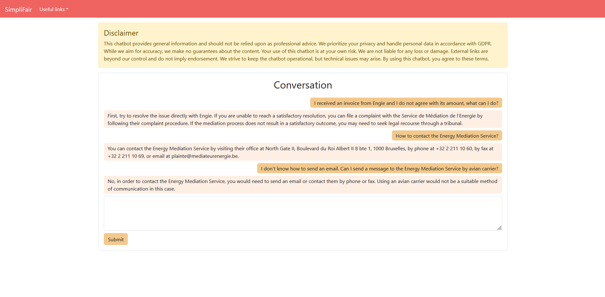

# SimpliFair

Welcome to our [SmartNation Hackathon](https://bosa.belgium.be/fr/AIhackathon) project! The solution we provide leverages ReactJS, FastAPI, Haystack, and GPT to guide Belgian citizens through the intricacies of the legal system, providing precise and verified information for justice seekers.

## Participants
- Mathilde Brousmiche
- Luc Gathy
- Benjamin Miraglio
- Clément Nicolas
- Mine Urfali

## How to Use It

The solution is packaged as a `docker compose` stack containing the following services:
- A frontend based on ReactJS. The `package.json` provides more information for those seeking to use `npm` to tinker with the frontend.
- An elasticsearch database storing vectorised legal documents.
- A backend RAG engine leveraging the haystack library, as well as GPT-based utilities.

## Looking under the hood  

The project is built with simplicity and accessibility in mind. To explore further the different components of the solution, you can use utilities such as `uvicorn` and `npm` locally.

Sample command use:
- `cd backend; uvicorn app.main:app --reload`
- `cd frontend; npm start`